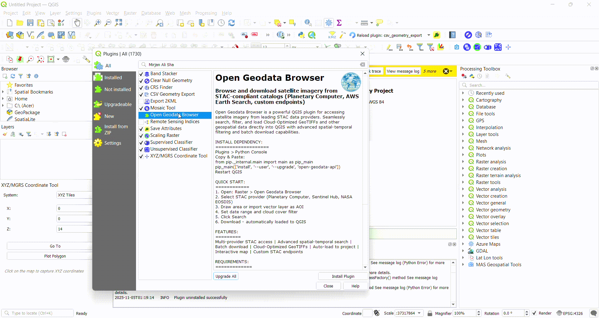
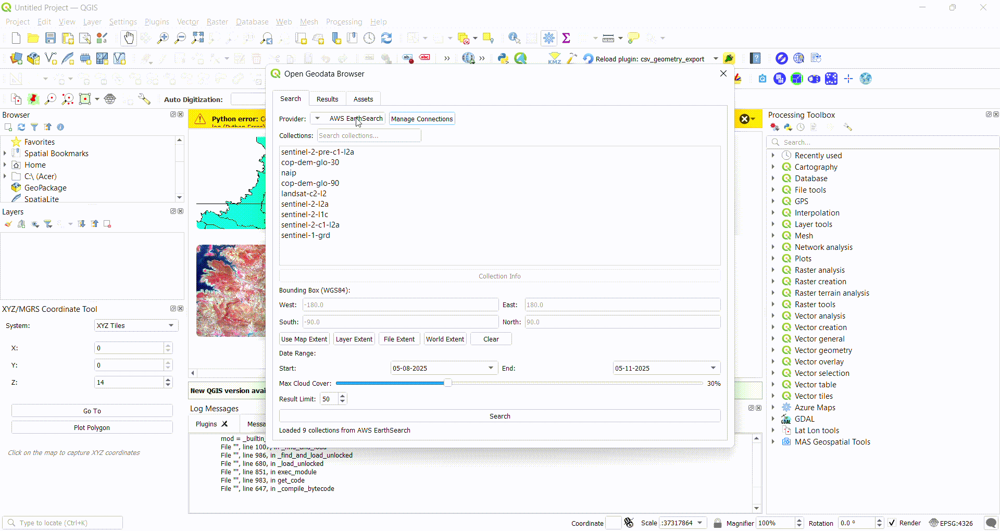

# 🌍 Open Geodata Browser - QGIS Plugin

<div align="center">

[](https://qgis.org)
[](https://python.org)
[](LICENSE)
[](https://github.com/Mirjan-Ali-Sha/open-geodata-browser)

**Browse and access satellite imagery from multiple STAC providers directly in QGIS**

[Installation](#-installation) • [Quick Start](#-quick-start) • [Features](#-features) • [Tools Guide](#-tools--features-guide) • [Support](#-support)

</div>

---
## 📹 Video Tutorials

<div align="center">

### Installation Guide


*Learn how to install dependencies and set up the plugin*

---

### Download Imagery Tutorial


*Discover how to search, filter, and download satellite imagery*

</div>


---

## ✨ Features

- 🛰️ **Multi-Provider Support** - Access Planetary Computer, Sentinel Hub, NASA EOSDIS, and custom STAC catalogs
- 🔍 **Advanced Search** - Spatial-temporal filtering with cloud coverage detection
- 📦 **Cloud-Optimized GeoTIFFs** - Direct COG access with efficient streaming
- ⬇️ **Batch Download** - Download multiple images in one operation
- 🗺️ **Interactive Map** - Browse provider footprints and data availability
- 🎯 **Flexible AOI Tools** - Multiple ways to define your area of interest
- 📊 **Results Preview** - View metadata and thumbnails before downloading
- 🔌 **Auto-Loading** - Downloaded data automatically added to QGIS project

---

## 📦 Installation

### Prerequisites

**Required:** Install `open-geodata-api` Python package

#### Method 1: QGIS Python Console (Recommended)

1. Open QGIS → **Plugins** → **Python Console**
2. Copy and paste:
```
from pip._internal.main import main as pip_main
result = pip_main(['install', '--user', '--upgrade', 'open-geodata-api'])
```

3. Wait 2-3 minutes for installation
4. Restart QGIS

#### Method 2: OSGeo4W Shell (Windows)
```
pip install open-geodata-api
```
===
### Plugin Installation

**Option A: From QGIS Plugin Repository** (Coming Soon)
1. Plugins → Manage and Install Plugins
2. Search "Open Geodata Browser"
3. Click Install

**Option B: From ZIP**
1. Download latest release: [Releases](https://github.com/Mirjan-Ali-Sha/open-geodata-browser/releases)
2. Plugins → Manage and Install Plugins → Install from ZIP
3. Select downloaded file
4. Enable plugin
5. Restart QGIS

---

## 🚀 Quick Start

### 1. Open the Browser
- **Raster** → **Open Geodata Browser**
- Or click the toolbar icon 🌐

### 2. Select STAC Provider
- Choose from dropdown: Planetary Computer, Sentinel Hub, NASA EOSDIS
- Or add custom STAC endpoint

### 3. Define Area of Interest (AOI)
Use any of these tools:
- 🗺️ **Use Map Extent** - Current map view
- 📐 **Layer Extent** - From existing layer
- 📁 **File Extent** - Import shapefile/GeoJSON
- 🌍 **World Extent** - Global coverage
- ✏️ **Draw Polygon** - Manual drawing

### 4. Set Search Filters
- **Date Range**: Start and end dates
- **Cloud Cover**: Max percentage (0-100%)
- **Collections**: Select satellite/sensor
- **Resolution**: Min/max spatial resolution

### 5. Search & Preview
- Click **Search** button
- Browse results in table
- Preview thumbnails and metadata
- Sort by date, cloud cover, or provider

### 6. Download & Load
- Select images from results
- Click **Download** or **Load to QGIS**
- Images automatically georeferenced and added to project

---

## 🛠️ Tools & Features Guide

### Area of Interest (AOI) Tools

#### 🗺️ Use Map Extent
**Purpose:** Quickly use your current QGIS map view as search area

**How to use:**
1. Navigate to your area in QGIS map canvas
2. Zoom to desired extent
3. Click "Use Map Extent" button
4. Bounding box automatically populated

**Example:**
Visible Area: New York City
Map Extent: -74.25, 40.50, -73.70, 40.91
→ Searches entire NYC area

**Best for:** Quick searches, familiar areas, iterative exploration

---

#### 📐 Layer Extent
**Purpose:** Use bounds of an existing QGIS layer

**How to use:**
1. Load a vector layer (shapefile, GeoJSON, etc.)
2. Select layer from Layer Panel
3. Click "Layer Extent" Button
4. Extent automatically calculated from layer bounds

**Example:**
Layer: "Nepal_Districts.shp"
→ Searches all districts in Nepal

**Best for:** Administrative boundaries, study areas, predefined regions

---

#### 📁 File Extent
**Purpose:** Import extent from external file

**How to use:**
1. Click "File Extent" button
2. Browse and select file:
   - Shapefile (.shp)
   - GeoJSON (.geojson)
   - KML (.kml)
   - GeoPackage (.gpkg)
3. Extent extracted from file bounds
4. File optionally loaded to map

**Example:**
File: "farm_boundary.geojson"
→ Searches only within farm boundary

**Best for:** Specific polygons, shared extents, repeated searches

---

#### 🌍 World Extent
**Purpose:** Search entire global coverage

**How to use:**
1. Click "World Extent" button
2. Extent set to: `-180, -90, 180, 90`
3. Filter by date/cloud to limit results

**Example:**
Draw around: Agricultural field
→ Searches only that specific field

**Best for:** Irregular shapes, precise areas, custom regions

---

### Search & Filter Tools

#### 📅 Date Range Picker
**Purpose:** Filter by temporal extent

**Options:**
- **Start Date**: Earliest acquisition date
- **End Date**: Latest acquisition date
- **Presets**: Last 7 days, Last month, Last year

**Example:**
Start: 2024-01-01
End: 2024-03-31
→ Only Q1 2024 imagery

---

#### ☁️ Cloud Cover Filter
**Purpose:** Filter by cloud percentage

**Settings:**
- **Max Cloud Cover**: 0-100%
- **Tooltip**: Hover shows typical values
- **Default**: 20% (mostly clear)

**Examples:**
0-10%: Very clear (rare)
10-30%: Mostly clear (good)
30-50%: Partly cloudy (moderate)
50-100%: Mostly/completely cloudy

---

#### 🛰️ Collection Selector
**Purpose:** Choose satellite/sensor dataset

**Available Collections (varies by provider):**
- **Sentinel-2**: 10m resolution, 5-day revisit
- **Landsat 8/9**: 30m resolution, 16-day revisit
- **MODIS**: 250-1000m, daily
- **Sentinel-1**: Radar (cloud-penetrating)

**How to use:**
1. Check collections to search
2. Multiple selections allowed
3. Results combined from all selected

---

#### 🔍 Resolution Filter
**Purpose:** Filter by spatial resolution

**Settings:**
- **Min Resolution**: Finest detail (meters)
- **Max Resolution**: Coarsest detail (meters)

**Example:**
Min: 10, Max: 30
→ Finds 10m and 30m imagery
→ Excludes 250m MODIS data

---

### Results Panel Tools

#### 📊 Results Table
**Columns:**
- **Thumbnail**: Preview image
- **Date**: Acquisition date/time
- **Cloud Cover**: Percentage
- **Provider**: Data source
- **Collection**: Satellite/sensor
- **ID**: Unique identifier

**Actions:**
- **Click row**: Show details
- **Double-click**: Preview full metadata
- **Right-click**: Context menu (download, info, copy URL)

---

#### 🔽 Batch Download
**Purpose:** Download multiple items at once

**How to use:**
1. Select multiple rows (Ctrl+Click or Shift+Click)
2. Click "Batch Download" button
3. Choose download location
4. Select asset types (TIF, PNG, metadata)
5. Progress bar shows status

**Example:**
Selected: 5 Sentinel-2 scenes
Assets: TrueColor.tif, NDVI.tif, metadata.json
→ Downloads 15 files total

---

#### 🖼️ Load to QGIS
**Purpose:** Directly load imagery without downloading

**How to use:**
1. Select image(s) from results
2. Click "Load to QGIS"
3. Choose asset (TrueColor, False Color, etc.)
4. Image streamed and added to map

**Benefits:**
- No disk space used
- Instant visualization
- Cloud-optimized streaming
- Automatic georeferencing

---

### Advanced Features

#### 🔗 Custom STAC Endpoints
**Purpose:** Connect to private/custom STAC catalogs

**How to add:**
1. Settings → Connections → Add New
2. Enter:
   - Name: "My STAC Catalog"
   - URL: `https://stac.example.com/catalog`
   - Auth Token (if required)
3. Save and select from provider dropdown

**Example:**
Name: "Company Satellite Archive"
URL: https://internal-stac.company.com
Token: your-api-token-here

---

#### 📈 Temporal Analysis
**Purpose:** Compare imagery over time

**How to use:**
1. Search with wide date range
2. Select multiple dates for same AOI
3. Load all to QGIS
4. Use Temporal Controller to animate

**Example:**
AOI: Agricultural field
Dates: Monthly for 1 year
→ View crop growth cycle

---

#### 🎨 Asset Type Selection
**Purpose:** Choose specific image bands/products

**Common Assets:**
- **TrueColor**: RGB composite (natural colors)
- **False Color**: NIR-R-G (vegetation analysis)
- **NDVI**: Normalized vegetation index
- **EVI**: Enhanced vegetation index
- **Thermal**: Surface temperature
- **SAR**: Radar backscatter

**How to select:**
1. In results, click "Assets" column
2. Check desired asset types
3. Download or load selected

---

## 📖 Usage Examples

### Example 1: Monitor Urban Growth

1. AOI Tool: Draw polygon around city
2. Date Range: 5 years (2019-2024)
3. Cloud Cover: < 20%
4. Collection: Landsat 8
5. Interval: Yearly (1 image per year)
6. Load all → Compare in Temporal Controller


---

## 🎯 Tips & Best Practices

### Search Performance
- ✅ Start with smaller AOI to test filters
- ✅ Use specific date ranges (< 1 year)
- ✅ Enable only needed collections
- ✅ Set appropriate cloud cover (don't use 0%)

### Download Optimization
- ✅ Download during off-peak hours
- ✅ Use COGs for streaming instead of download
- ✅ Select only required assets
- ✅ Batch download similar items together

### Data Quality
- ✅ Check cloud cover in preview
- ✅ Verify date is during target season
- ✅ Compare multiple providers
- ✅ Read metadata for processing level

### Troubleshooting
- 🔧 No results? Expand date range or AOI
- 🔧 Slow search? Reduce AOI size
- 🔧 Download fails? Check internet connection
- 🔧 Plugin won't load? Reinstall dependencies

---

## 📋 Keyboard Shortcuts

| Shortcut | Action |
|---|---|
| `Ctrl+B` | Open Geodata Browser |
| `Ctrl+F` | Focus search box |
| `Enter` | Execute search |
| `Ctrl+Click` | Multi-select results |
| `Shift+Click` | Range select results |
| `Del` | Clear AOI |
| `Esc` | Cancel operation |

---

## 🔧 System Requirements

- **QGIS**: 3.28.0 or later
- **Python**: 3.9 or later
- **RAM**: 2 GB minimum, 4 GB recommended
- **Disk**: 20 MB for plugin, varies for imagery
- **Internet**: Required for data access

---

## 🤝 Support

### Documentation
- 📚 [Wiki](https://github.com/Mirjan-Ali-Sha/open-geodata-browser/wiki)
- 📖 [User Guide](https://github.com/Mirjan-Ali-Sha/open-geodata-browser/wiki/User-Guide)
- 🎓 [Tutorials](https://github.com/Mirjan-Ali-Sha/open-geodata-browser/wiki/Tutorials)

### Community
- 💬 [Discussions](https://github.com/Mirjan-Ali-Sha/open-geodata-browser/discussions)
- 🐛 [Report Issues](https://github.com/Mirjan-Ali-Sha/open-geodata-browser/issues)
- 📧 Email: mastools.help@gmail.com

### Contributing
Contributions welcome! See [CONTRIBUTING.md](CONTRIBUTING.md)

---

## 📜 License

MIT License - see [LICENSE](LICENSE) file

---

## 👤 Author

**Mirjan Ali Sha**
- GitHub: [@Mirjan-Ali-Sha](https://github.com/Mirjan-Ali-Sha)
- Email: mastools.help@gmail.com

---

## 🙏 Acknowledgments

- [QGIS](https://qgis.org) - Open source GIS platform
- [Planetary Computer](https://planetarycomputer.microsoft.com) - Microsoft's geospatial platform
- [Sentinel Hub](https://www.sentinel-hub.com) - Copernicus data provider
- [STAC Specification](https://stacspec.org) - SpatioTemporal Asset Catalog
- [PySTAC Client](https://github.com/stac-utils/pystac-client) - STAC Python library

---

<div align="center">

**⭐ Star this repo if you find it useful!**

[Report Bug](https://github.com/Mirjan-Ali-Sha/open-geodata-browser/issues) · [Request Feature](https://github.com/Mirjan-Ali-Sha/open-geodata-browser/issues) · [Documentation](https://github.com/Mirjan-Ali-Sha/open-geodata-browser/wiki)

</div>
